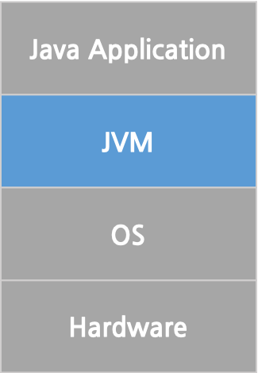

# 자바란?

Java 를 제대로 공부해본 적은 처음이다. 대학교 3학년 시절 안드로이드 어플을 만들기 위해서 교수님이 Head First Java를 참조하여 만들어 주신 강의자료를 본게 전부이다.
물론 C++ 을 잘 알고 있었기 때문에 기본적인 문법을 익히는 방법은 어렵지 않았다.
하지만, 어떠한 방식으로 동작하는지 정확하게 아는 것이 중요하다고 생각했고 처음부터 공부하려 한다.

Java 는 가전제품 SW 를 개발하기 위해 처음 개발 된 언어이다. Sun에서 개발한 뒤 Oracle 에 인수되었다고 한다. (정확히 기억나지 않는데 수정이 필요할 것 같다.)

자바언어의 특징들을 나열해 보면, 운영체제 독립적이다, 객체지향 언어이다, 멀티쓰레드를 지원한다, 네트워크와 분산처리를 제공한다, 동적로딩을 지원한다, 자동 메모리 관리(Garbage Collection)를 지원한다 등이 있다. 특징들에 대해 정리를 한번 해보겠다.

## 자바언어의 특징
1. 운영체제 독립적이다

Java는 JVM 위에서 실행되기 때문에 운영체제와 의존성이 없다. 대신 운영체제마다 JVM은 종속적이기 때문에 수많은 OS에 대한 JVM 개발이 필수적이다.

2. 객체지향 언어이다

객체지향 프로그래밍 언어로 객체지향 특성인 상속, 캡슐화, 다형성이 잘 적용되어 있다.

3. 멀티쓰레드를 지원한다

일반적으로 멀티쓰레드는 운영체제에 따라 구현방법과 처리 방식이 다르다. 그러나 자바에서는 이에 영향을 받지 않으며 쓰레드 스케쥴링을 자바 인터프리터가 실행한다.

4. 네트워크와 분산처리를 지원한다

다양한 네트워크 API를 제공하며, 인터넷 대규모 분산 시스템 개발에 효과 적이다. (왜 효과적인건지는 좀 더 알아봐야 겠다)

5. 동적로딩을 지원한다

실행 시에 모든 클래스가 로드되는 것이 아닌 필요한 시점에 로드되는 형태이다. 따라서, 일부 클래스가 변경되어도 전체 컴파일을 하지 않아도 되기 때문에 유연한 구조를 가지고 있다.

6. 자동 메모리 관리(Garbage Collection)를 지원한다

자바는 프로그램이 실행되는 동안 Garbage Collector가 자동으로 메모리를 관리해 주기 때문에 별도로 메모리 관리가 필요가 없다. C++ 개발자 입장에서는 굉장히 부러운 기능이다. 계속 실행되는 부담?은 있지만 프로그램 개발에 집중 할 수 있게 해주며, 최적화도 가능한 것으로 알고 있다. (이 부분도 좀 더 심도있게 알아볼 필요가 있어 보인다)

## Java Virtual Machine

JVM 은 Java 애플리케이션이 실행되는 Virtual Machine 이다. 이 JVM 덕분에 자바는 운영체제 독립적이라는 특성을 갖게 된다. 이는 애플리케이션이 실행될 때, OS 위에 JVM이라는 Layer가 하나 생기는 것과 동일하다고 보면 된다.

<Java Application 실행 환경>

## Java 애플리케이션이 작성되고 실행되는 과정

자바 프로그램(.java)을 작성하고 이를 자바 컴파일러가 Byte code(.class) 로 변환시킨다. 이를 자바 인터프리터가 하드웨어가 식별 할 수 있도록 변경해서 실행시켜준다.

(이것도 한번 그림을 그려서 넣어보자)
